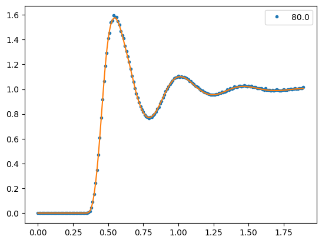

# conc2RDF
A program that employs a neural network to reproduce and generate radial distribution functions (RDF) depending on a single parameter for the physical system (concentration). It is trained on RDF from atomistic simulations or empirical RDF.



## Installation

## Usage
To set parameters like path to file containing directory in a config.toml file. Use the same notation as in default_config.toml. Every parameter that is not explicitly set will be taken from the default_config.toml.
To run the program use:
```python main.py -i path/to/config.toml```
Or
```python main.py -i```
to use the default_config.toml.

To get the loss-evolution for the best training run use
```python main.py -ad```

To get the predictions compared to the actual data run
```python main.py -ap path/to/training-data```

To get the MSE and MAE for the different concentrations run
```python main.py -ae path/to/training-data```

